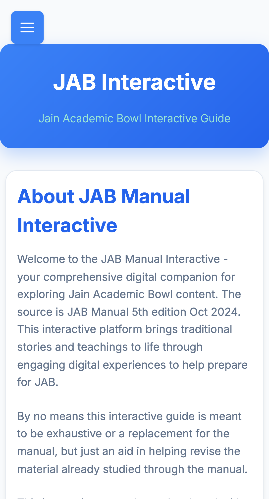

# JAB Interactive Manual 🎓

Welcome to the Jain Academic Bowl (JAB) Interactive Manual — a fun, digital way to study for the JAB competition!



## 🚀 Quick Start

Just run this one command to get started:

```bash
./startup.sh
```

That's it! The script will:
- ✅ Check if you have the right tools installed
- ✅ Help install anything you're missing
- ✅ Start the website at http://localhost:8080
- ✅ Open your browser automatically

## 📋 Prerequisites for Contributors

Before you start contributing, make sure you have:

1. **🤖 An AI Coding Assistant** — Like [Antigravity](https://console.cloud.google.com/), Cursor, GitHub Copilot, or similar "vibe coding" tools
2. **🐙 A GitHub Account** — Free at [github.com/signup](https://github.com/signup)
3. **📚 Basic Git Knowledge** — Learn the basics at [Git Tutorial](https://www.w3schools.com/git/)
4. **🌐 Some HTML/CSS/JS** — Learn at [W3Schools](https://www.w3schools.com/)

> 💡 **Tip:** You can ask your AI coding agent to explain any code you don't understand — it's a great way to learn!

## 🎨 How to Contribute (Vibe Coding Style!)

Contributing is easy with AI assistance:

1. **Find an issue** — Something looks broken or could be better?
2. **Take a screenshot** — Show your AI what's wrong
3. **Ask your AI agent** — "Can you help me fix this?"
4. **Test it** — Run `./startup.sh` and check your changes
5. **Submit a Pull Request** — Share your fix with everyone!

See our [Vibe Coding Guide](docs/vibe-coding-guide.md) for detailed tips!

## 📖 Learn More

| Document | Description |
|----------|-------------|
| [Vibe Coding Guide](docs/vibe-coding-guide.md) | How to contribute using AI assistants |
| [Architecture](docs/architecture.md) | Technical details for curious minds |
| [Build System](BUILD.md) | How the build and deploy works |
| [Contributing](CONTRIBUTING.md) | Contribution guidelines |

## 🤝 Get Help

- **Create an Issue** — [Report bugs or request features](https://github.com/absolute-zerokelvin/JAB/issues)
- **Ask Your AI** — Your coding agent can explain code and help you fix things!

## 📜 License

MIT License — See repository for details.

---

*Built with ❤️ by the JAB Teachers of JCNC and contributors like you!*
